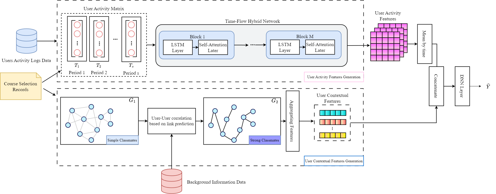

# CA-TFHN
## About
This project is the implementation of the paper "MOOCs Dropout Prediction via Classmates Augmented Time-Flow Hybrid Network"


## Abstract
Massive Open Online Courses (MOOCs) provides learners
a platform for free learning. However, MOOCs have been criticized for
the high dropout rates in recent years. For the purpose of predicting
users’ potential dropout risk in advance, a novel framework named as
Classmates Augmented Time-Flow Hybrid Network (CA-TFHN) is proposed in this paper. TFHN, absorbed the advantages of LSTM and self-attention mechanism, is designed to generate the activity features of
users by using users’ learning records. At the same time, an effective
correlation calculation is defined based on users’ potential interests on
courses with link prediction, bringing in relationships of classmates. A
user graph is reconstructed with the influences among classmates. User
features generated from this graph are fused to the activity features
of user, resulting in accurate dropout prediction. Experiments on the
XuetangX dataset demonstrate the effectiveness of CA-TFHN in predicting dropout of MOOCs.

## Dependencies
```torch==1.11.0```<p>
```torch-geometric==2.1.0.post1```<p>
```torch-cluster==1.6.0```<p>
```torch-scatter==2.0.9```<p>
```torch-sparse==0.6.14```<p>
```torch-spline-conv==1.2.1```<p>
```numpy==1.22.3```<p>
```pandas==1.4.2```<p>
```scikit-learn==1.1.2```<p>


## Dataset
XuetangX dataset: [Downloads](https://github.com/wzfhaha/dropout_prediction) <p>
KDD Cup 2015 dataset: [Downloads](http://lfs.aminer.cn/misc/moocdata/data/kddcup15.zip)

